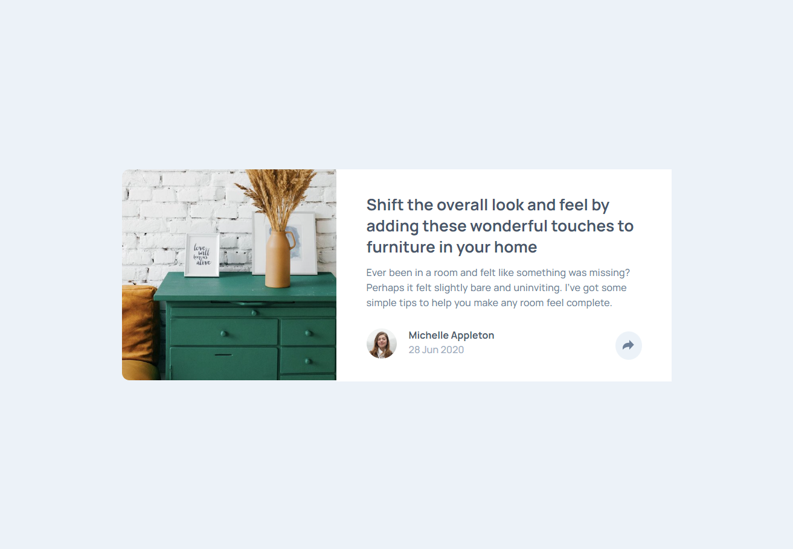
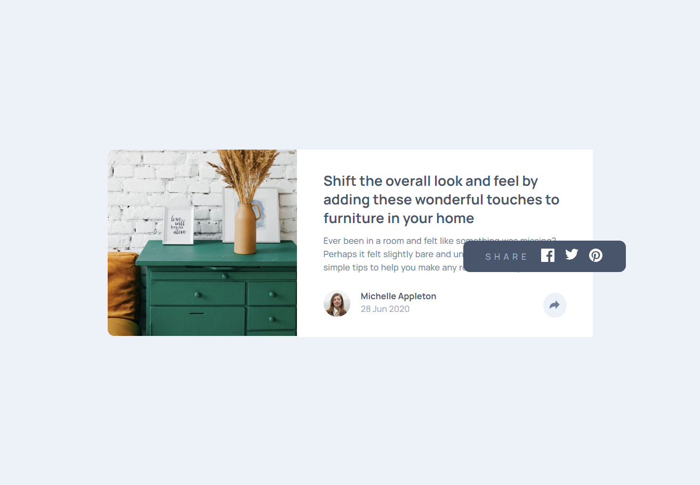
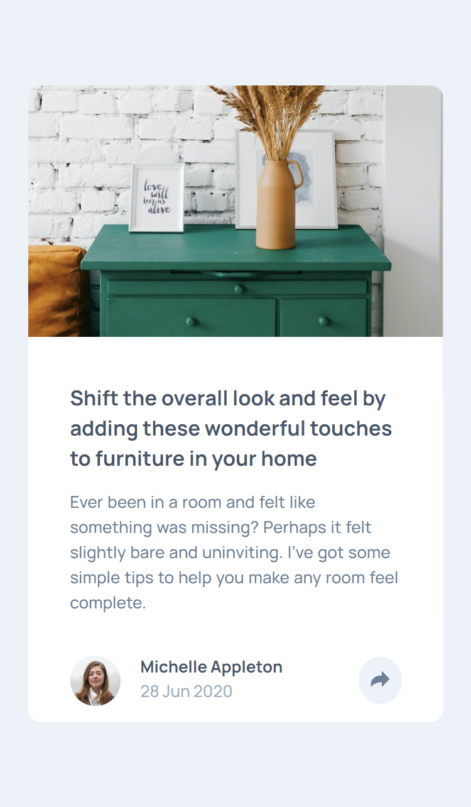
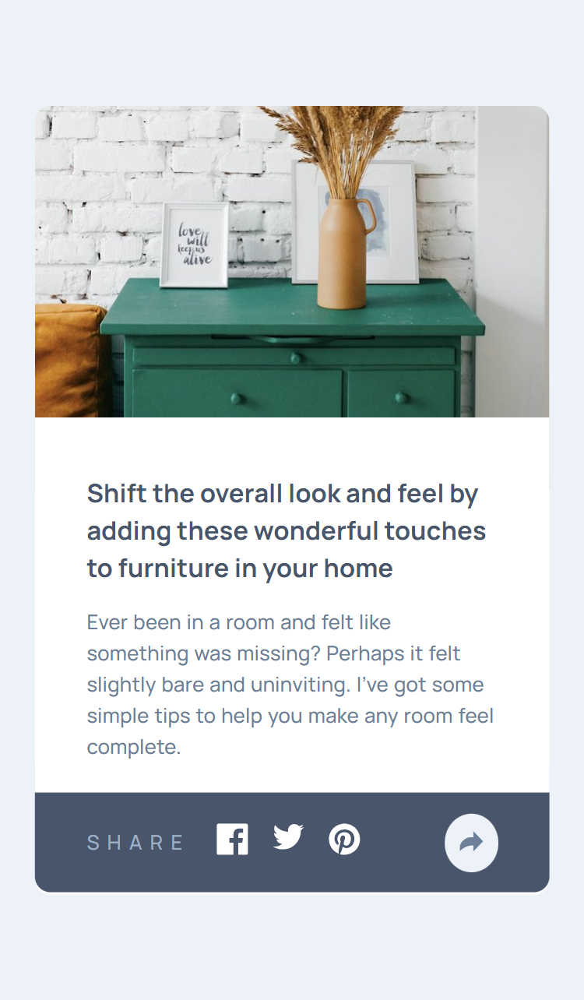

# Frontend Mentor - Article preview component solution

Esta é uma solução para o [Article preview component challenge on Frontend Mentor](https://www.frontendmentor.io/challenges/article-preview-component-dYBN_pYFT). Os desafios do Frontend Mentor ajudam você a melhorar suas habilidades de codificação através da construção de projetos realistas. 

## Índice

- [Visão geral](#visão-geral)
  - [Screenshot](#screenshot)
  - [Links](#links)
- [Meu processo](#meu-processo)
  - [Construído com](#construído-com)
  - [O que eu aprendi](#o-que-eu-aprendi)
  - [Desenvolvimento contínuo](#desenvolvimento-contínuo)
- [Autor](#autor)

## Visão geral

### Screenshot

Desktop

Desktop ativo

Mobile

Mobile ativo

### Links

- Live Site URL: [Article preview component solution]()

## Meu processo

### Construído com

- Semantic HTML5 markup
- CSS custom properties
- Flexbox
- CSS Grid
- Mobile-first
- JS library

### O que eu aprendi

Neste projeto eu usei JS para tornar o site mais interativo pela primeira vez.

### Desenvolvimento contínuo

Planejo continuar construindo projetos com JS para praticar e fixar o que aprendi sobre essa linguagem.

## Autor

- Frontend Mentor - [@Isabela-Fernanda](https://www.frontendmentor.io/profile/Isabela-Fernanda)